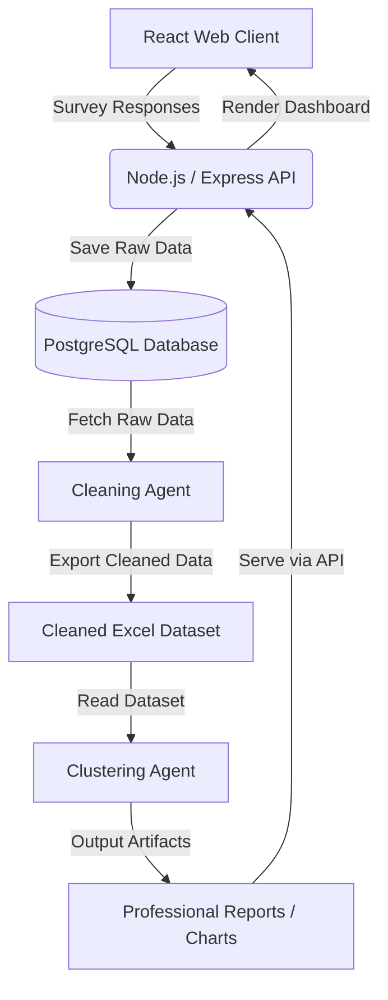

# StemValley — AI-Powered Student Community Intelligence Platform

StemValley is a comprehensive, end-to-end AI platform designed to dynamically gather, clean, and analyze student data to foster intelligent communities. It bridges a modern React frontend with a robust Node.js backend, and relies on two distinct Python-based AI agents to process natural language, cluster students by semantic similarity, and generate professional faculty reports.

---

## 🏗️ System Architecture

The system operates across a **5-stage pipeline**:



### 1. The Frontend (React + Vite)
- **Role**: Provides the user-facing interface. Includes a Landing Page, a secure Authentication flow (Sign Up / Sign In), an interactive, animated Chatbot Survey, and a Faculty Analytics Dashboard.
- **Key Tech**: React, React Router, Context API, Chart.js, Framer Motion.
- **Design System**: A custom-built **Dark Glassmorphism Theme** (`client/src/index.css`) utilizing pure CSS animations and floating ambient gradient orbs. No TailwindCSS is used.

### 2. The Backend (Node.js + Express)
- **Role**: Serves as the central API orchestrator. Handles user authentication, serves survey questions sequentially, saves responses to the database, and provides endpoints to trigger the Python AI agents.
- **Key Tech**: Node.js, Express, `pg` (node-postgres), `bcryptjs` (password hashing), `jsonwebtoken` (session handling).

### 3. The Database (PostgreSQL)
- **Role**: Persistent storage for users, survey questions, and raw survey responses.
- **Core Tables**:
  - `users`: Stores authenticated users (id, name, email, password_hash, department).
  - `survey_questions`: Stores the sequential survey logic (id, sequence_no, question, type, options).
  - `survey_responses`: Stores individual answers, linked via `user_id` and `session_id`.

### 4. The Cleaning Agent (Python + Groq LLaMA)
- **Role**: Automatically fetches raw survey responses from the PostgreSQL database and applies advanced NLP (via the Groq API utilizing LLaMA 3.3) to standardize, correct spelling, normalize formatting, and remove junk data.
- **Output**: Exports a structured, pivot-table style Excel file (`outputs/final_clean_dataset.xlsx`) where each row represents a single student and columns represent questions.

### 5. The Clustering Agent (Python + ML)
- **Role**: Reads the cleaned Excel dataset, generates high-dimensional embeddings using `sentence-transformers`, and clusters students into meaningful semantic communities using `scikit-learn` (K-Means/HDBSCAN).
- **Output**: Generates interactive visual charts (Matplotlib) and exports professional summary reports in PDF, Excel, and PPTX formats.

---

## 📂 Complete Directory Structure

```text
stemvelley-main/
├── client/                              # 🌐 React Frontend Workspace
│   ├── public/
│   ├── src/
│   │   ├── components/
│   │   │   ├── auth/                    # Sign In / Sign Up Forms
│   │   │   ├── dashboard/               # Chart.js visualizers
│   │   │   ├── layout/                  # Navbar & Animated Orbs Background
│   │   │   ├── survey/                  # Chatbot UI components
│   │   │   └── ui/                      # Base atoms (Loaders)
│   │   ├── context/                     # React Context (AuthContext)
│   │   ├── pages/                       # Route entrypoints (Landing, Auth, Survey, Dash)
│   │   ├── App.jsx                      # React Router configuration
│   │   ├── main.jsx                     # Vite entrypoint
│   │   └── index.css                    # Master Design System (Vanilla CSS)
│   ├── package.json
│   └── vite.config.js
│
├── server/                              # ⚙️ Node.js Backend Workspace
│   ├── config/
│   │   └── db.js                        # PostgreSQL connection pool
│   ├── controllers/
│   │   ├── authController.js            # JWT & bcrypt logic
│   │   └── surveyController.js          # Chatbot logic & answer saving
│   ├── middleware/
│   │   └── authMiddleware.js            # JWT protection for API routes
│   ├── routes/
│   │   ├── authRoutes.js
│   │   ├── reportRoutes.js              # Triggers Python agents via child_process
│   │   └── surveyRoutes.js
│   ├── create_db.js                     # Script to initialize empty PG database
│   ├── seed_questions.js                # Script to seed initial chatbot questions
│   ├── server.js                        # Express app entrypoint & auto-table creation
│   └── package.json
│
├── agents/                              # 🤖 Python AI Agents Workspace
│   ├── cleaning/                        # Agent 1: Data Normalization
│   │   ├── agent.py                     # Groq LLM integration
│   │   ├── cleaner.py                   # 14-step NLP cleaning logic
│   │   ├── database.py                  # PostgreSQL fetcher
│   │   ├── exporter.py                  # Excel exporter
│   │   ├── main.py                      # Cleaning orchestrator
│   │   ├── profiler.py                  # Data shape analysis
│   │   ├── structure.py                 # Long -> Wide format pivot
│   │   └── validator.py                 # Post-cleaning quality checks
│   │
│   ├── clustering/                      # Agent 2: Community Intelligence
│   │   ├── app/
│   │   │   ├── api/                     # FastAPI endpoints
│   │   │   ├── core/                    # Configurations
│   │   │   ├── db/                      # Vector DB connections
│   │   │   ├── models/                  # SQLAlchemy ORMs
│   │   │   └── services/                # ML Models (scikit-learn, sentence-transformers)
│   │   ├── sql/
│   │   └── README.md                    # Specific Clustering docs
│   │
│   ├── outputs/                         # 📁 Shared output artifacts directory
│   │   └── final_clean_dataset.xlsx     # Generated by cleaning, read by clustering
│   │
│   └── requirements.txt                 # Consolidated Python dependencies
│
├── .gitignore
└── README.md                            # You are here
```

---

## 🛠️ Step-by-Step Setup Guide

### 1. Prerequisites
Ensure you have the following installed on your machine:
*   **Node.js** (v18+)
*   **Python** (v3.10+)
*   **PostgreSQL** (Running locally on default port 5432)

### 2. Environment Variables
You must create two `.env` files.

**File 1: `server/.env`**
```env
PORT=5000
DB_USER=postgres
DB_HOST=localhost
DB_NAME=survey_chatbot
DB_PASSWORD=your_postgres_password
DB_PORT=5432
JWT_SECRET=super_secret_key_for_auth_tokens
```

**File 2: `agents/cleaning/.env`**
```env
GROQ_API_KEY=your_groq_api_key_here
DB_USER=postgres
DB_HOST=localhost
DB_NAME=survey_chatbot
DB_PASSWORD=your_postgres_password
DB_PORT=5432
```

### 3. Database Initialization
Ensure PostgreSQL is running, then use the provided setup scripts inside the `server/` directory to create the database and seed it with the default survey questions.

```bash
cd server
npm install
node create_db.js          # Creates the "survey_chatbot" database
node seed_questions.js     # Inserts the 10 core chatbot questions
```
*Note: When you start the server using `npm start`, it will automatically create all required tables (`users`, `survey_questions`, `survey_responses`) if they do not exist.*

### 4. Running the Servers
You will need to run the Frontend and the Backend simultaneously.

**Terminal 1: Backend**
```bash
cd server
npm start
# Runs on http://localhost:5000
```

**Terminal 2: Frontend**
```bash
cd client
npm install
npm run dev
# Runs on http://localhost:5173
```

### 5. Installing Agent Dependencies
The Python agents are executed automatically by the backend API, but their environment must be prepared first.
```bash
cd agents
pip install -r requirements.txt
```

---

## 🚀 The Complete Usage Workflow

1.  **Onboarding**: The user navigates to `localhost:5173`. They are greeted by the landing page and click **Get Started**.
2.  **Authentication**: The user signs up. Their password is cryptographically hashed via `bcrypt` and stored in PostgreSQL. A `JWT` token is returned to the client and stored locally to maintain the session.
3.  **Survey Collection**: The user takes the interactive survey. Every answer they submit hits `POST /api/survey/next` and is saved securely into the `survey_responses` table, forever tied to their unique `user_id`.
4.  **Dashboarding**: Upon completion, the user is redirected to `/dashboard`. The frontend hits `GET /api/reports/stats`, which dynamically queries PostgreSQL to aggregate and return the distributions of all survey responses platform-wide. `Chart.js` visualizes this data instantly.
5.  **Agent Invocation**: An administrator (or the user) clicks **"Run AI Pipeline"** on the dashboard. This hits `POST /api/reports/generate`.
6.  **Data Cleaning**: The Node.js backend spawns a child process invoking `python agents/cleaning/main.py`. The cleaning agent downloads the raw data from PostgreSQL, asks Groq LLaMA how to clean it, standardizes it, and saves a pristine Excel dataset to `agents/outputs/final_clean_dataset.xlsx`.
7.  **Clustering & Reporting**: The backend subsequently invokes the Clustering Agent. It reads the Excel file, utilizes `sentence-transformers` to plot students on an N-dimensional vector space, clusters them with `K-Means`, and outputs robust mathematical graphs (`.png`) and comprehensive narrative reports (`.pdf`, `.pptx`).

---

## 📊 Database Schema Cheat Sheet

If you ever need to query the database directly, here are the core structures:

**`users` table**
- `id` (PK, Serial)
- `full_name` (Varchar)
- `email` (Varchar, Unique)
- `password_hash` (Varchar)
- `department` (Varchar)
- `created_at` (Timestamp)

**`survey_questions` table**
- `id` (PK, Serial)
- `sequence_no` (Int, Unique) -> Defines order
- `question` (Text)
- `question_type` (Varchar) -> `open_ended`, `single_choice`, `multiple_choice`
- `options` (JSONB) -> String array of choices
- `category` (Varchar) -> Allows logic branching

**`survey_responses` table**
- `id` (PK, Serial)
- `session_id` (UUID)
- `user_id` (FK -> users.id)
- `question_id` (FK -> survey_questions.id)
- `question` (Text)
- `answer` (Text)
- `created_at` (Timestamp)

---

## 🔀 Dynamic Survey Logic Configuration

The survey operates dynamically based on student responses. You can insert new questions directly into the PostgreSQL database. The branching logic works using the `category` and `trigger_value` columns.

### How it works:
1. **General Questions**: All users start by answering questions where `category = 'general'`.
2. **Branching**: If a user answers a question (e.g., "What is your department?"), the system will check if any *other* questions have a `trigger_value` matching their answer.
3. **Fetching the branch**: If a match is found, the system pulls all questions that have `category = [their_answer]`.

### Example (Adding questions via SQL):
Let's say you want to ask specific questions *only* if the student is in "Computer Science".

```sql
-- The general question that triggers the branch:
INSERT INTO survey_questions (sequence_no, question, question_type, options, category, trigger_value)
VALUES (2, 'What is your department?', 'single_choice', '["Computer Science", "Biology"]', 'general', null);

-- The specific question that gets fetched if they choose "Computer Science":
-- Notice: category = 'Computer Science' and trigger_value = 'Computer Science'
INSERT INTO survey_questions (sequence_no, question, question_type, options, category, trigger_value)
VALUES (100, 'Which programming language do you prefer?', 'single_choice', '["Python", "Java", "C++"]', 'Computer Science', 'Computer Science');
```
*Note: Make sure the `trigger_value` exactly matches the option string in the previous question!*
